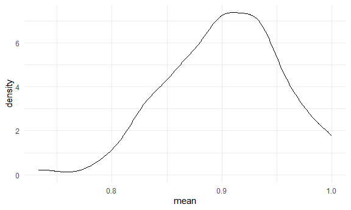
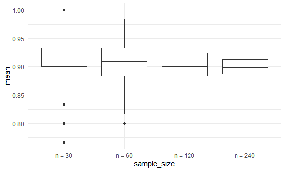

Simulation
================

Load key packages.

``` r
library(tidyverse)
library(rvest)
```

    ## 
    ## Attaching package: 'rvest'

    ## The following object is masked from 'package:readr':
    ## 
    ##     guess_encoding

Set seed for reproducibility.

``` r
set.seed(12345)
```

## Simulate sample mean and sd

Here’s an old function:

``` r
sim_mean_sd = function(n_obs, true_p = .9) {
  
  x_vec = rbinom(n = n_obs, size = 1, prob = true_p)

  tibble(
    mean = mean(x_vec),
    sd = sd(x_vec)
  )
  
}
```

Let’s iterate to see how this works UNDER REPEATED SAMPLING!!!

``` r
output = vector("list", length = 100)

for (i in 1:100) {
  
  output[[i]] = sim_mean_sd(n_obs = 30)
  
}

sim_results =
  bind_rows(output)

sim_results |> 
  ggplot(aes(x = mean)) + geom_density()
```



``` r
sim_results |> 
  summarize(
    mu_hat = mean(mean),
    sd_hat = sd(mean)
  )
```

    ## # A tibble: 1 × 2
    ##   mu_hat sd_hat
    ##    <dbl>  <dbl>
    ## 1  0.903 0.0518

use a map function

``` r
sim_result_df =
  expand_grid(
    sample_size = c(30, 60, 120, 240),
    iter = 1:100
  ) |> 
  mutate(estimate_df = map(sample_size, sim_mean_sd)) |> 
  unnest(estimate_df)

sim_result_df |> 
  mutate(
    sample_size = str_c("n = ", sample_size),
    sample_size = fct_inorder(sample_size)
  ) |> 
  ggplot(aes(x = sample_size, y = mean)) +
  geom_boxplot()
```


